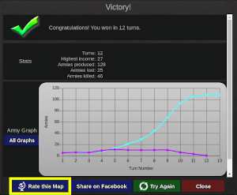
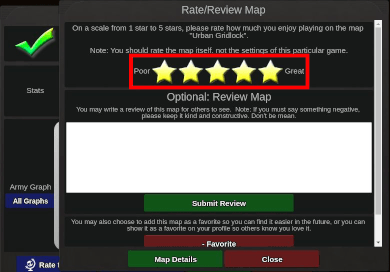

# How to rate a map
1. Play a game. The game can be:
    - a single player game vs AI or
    - a multi-player game
    - Notice that rating/reviews for community levels *go to the map* instead of the level.
2. Once the game ends, click the "rate this map" button at the victory screen:
    - 
3. Choose the number of stars
    - 
4. Click close (there is no need to submit a review)
